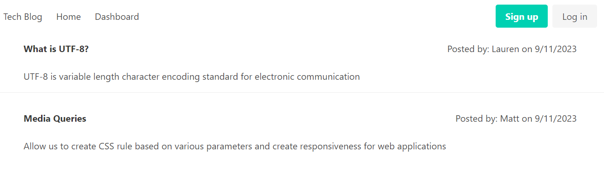
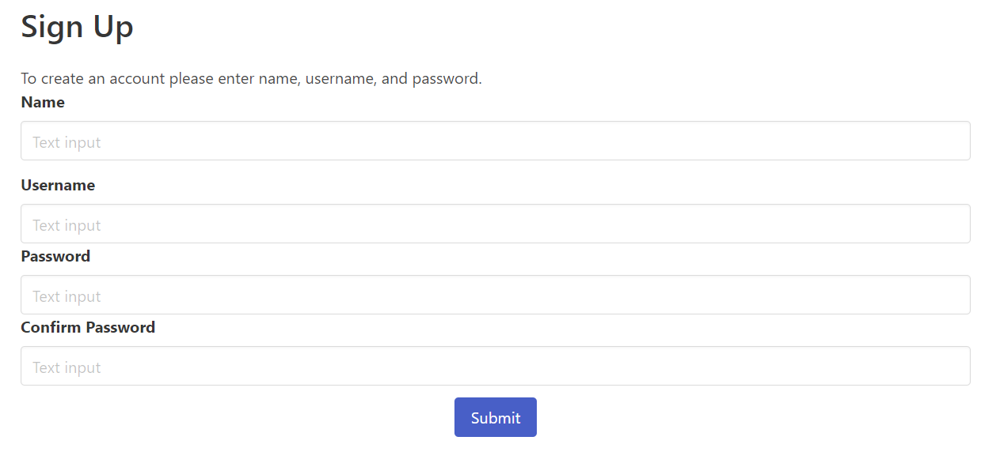
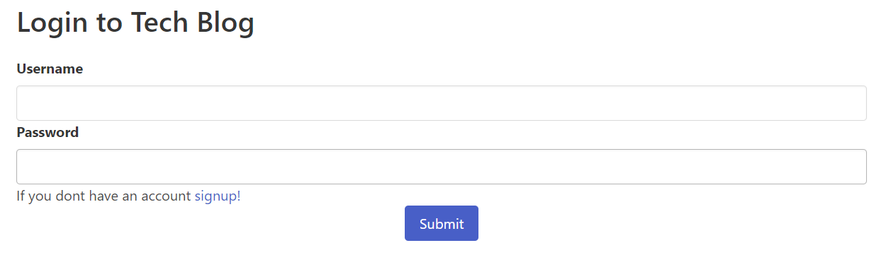
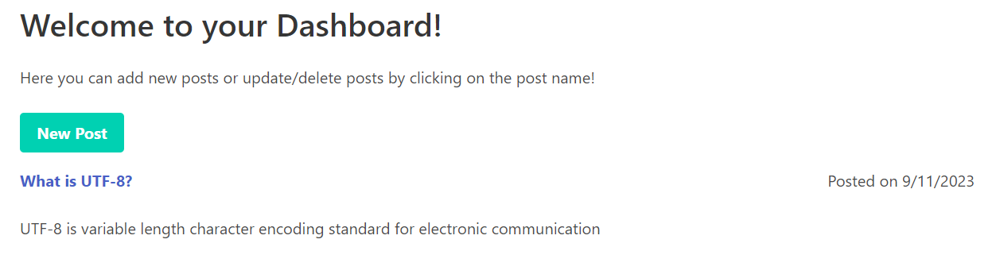

# Tech Blog

## Description

The application is a tech blog that will allow users to publish blog posts to share with the community.

The application was created using the following criteria:

- When users enter the site they can see existing blog post and can login or signup
- If not logged in re-routed to login page on attempt to access dashboard
- When signing up name, username, and password required; password is confirmed; username must be unique
- On submission of sign up the credentials are stored with hashed password for security
- After signup or login, the nav bar will show the logout button
- When viewing the homepage user sees existing post with name of blogger and date created
- When user clicks on the dashboard they see their existing posts
- When click on add post button user prompted for post name and text and add to their dashboard and home dashboard
- When user clicks on existing blog name in their dashboard able to update or delete a post

## Table of Contents

- [Installation](#installation)
- [Usage](#usage)
- [License](#license)
- [Contributing](#contributing)

## Installation

In order to use the application node.js will need to be installed.  
Node.js Installation: https://nodejs.org/en/download

Node packages:

- bycrypt
- connect-session-sequelize
- dotenv
- express
- express-session
- handlebars
- mysql2
- sequelize
- express-handlebars

## Usage

The program is deployed in heroku link below. Upon entering site can see the current posts on the home page. To add posts click the button in the nav bar to login or signup. Follow the prompts and will login you into the site. On your dashboard you can update/delete your current posts and add new posts that will appear on homepage. When you are done using the application logout.  
To run program from IDE create env file with variables found in env.Example. Then type node server.js into the terminal. Click into the website link in the terminal to view the tech blog.

 
 
 
 

## License

MIT License

## Contributing

N/A

## Heroku Deployment

[Heroku Link]()
